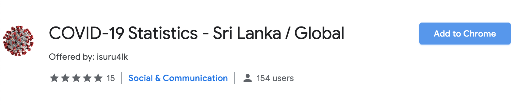
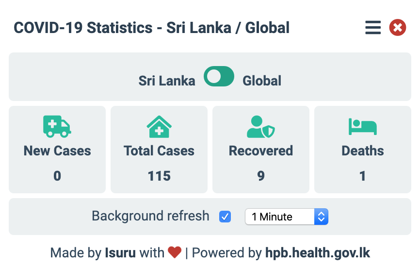

# COVID-19 Statistics - Sri Lanka / Global
With this extension, you'll be able to see the latest COVID-19 statistics across Sri Lanka / Global easily on your browser screen without a hassle.

## How to install
* Visit https://chrome.google.com/webstore/detail/covid-19-statistics-sri-l/lpbpopaphioiplpigiahhkkjffiacbdi
* Click Add to Chrome button to install.

## How to enable background refresh
* Click on the extension icon on the browser.
* Click on the hamburge icon on top left corner.
* Click on background refresh checkbox.
* Change the background refresh interval as you wish.

## How to install as a developer
* Visit chrome://extensions/
* Turn the developer mode on. 
* Click Load unpacked on top left corner and open the extension directory.

Special thanks goes to https://hpb.health.gov.lk/